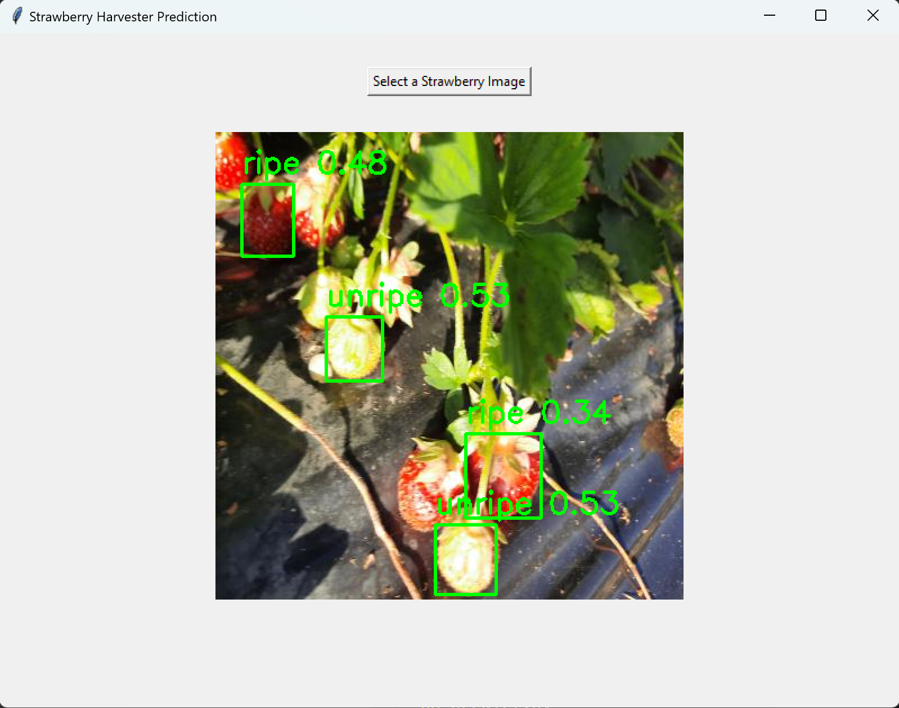

# Smart Strawberry Harvesting
#### Video Demo:  <https://youtu.be/jBklZRVrfpQ>
#### Description:
This project aims to develop a smart system for harvesting strawberries using machine learning techniques. This project detects and classifies strawberries in two classes `ripe` (ready to be picked), and `unripe` (not ready to be picked).

To achieve this, I've used the pretrained [YOLOv8.pt](https://docs.ultralytics.com/models/yolov8/) model which is popular and widely used for many application in the real-time object detection field, being ideal for using it in in Smart Farming applications as in this project.

## Motivation

I've opted to work on this project since I’ve always lived in an agricultural province of Ecuador, where strawberry production is the main source of income for families. The hardest and most time-consuming task is strawberry picking, which is currently performed manually, requiring farmers to adopt a crouching position, making it uncomfortable and causing them to tire easily. So, I’ve decided to step forward to tackle this problem through the use of AI tools.  
I invite you to check out some [articles](https://www.lahora.com.ec/tungurahua/tungurahua-potencial-productor-mora-fresa/) and [videos](https://www.google.com/search?q=cultivo+de+fresas+en+ecuador&oq=cultivo+de+fresas+en+ecuador&gs_lcrp=EgZjaHJvbWUyCwgAEEUYExg5GIAEMgoIARAAGIAEGKIEMgoIAhAAGIAEGKIEMgoIAxAAGIAEGKIEMgoIBBAAGIAEGKIE0gEIODU3MmowajeoAgCwAgA&sourceid=chrome&ie=UTF-8#fpstate=ive&vld=cid:138eb5e0,vid:1x0vkRa4YKg,st:0) about strawberry production in Ecuador.  
**Note:** The content is in Spanish, so you might need to translate it to English or activate video subtitles.  

## Project Process

1. **Dataset collection**: The [Dataset from Roboflow](https://universe.roboflow.com/arab-academy-for-science-and-technology-rvgsi/strawberry-pen/dataset/1) was used in this project and split into train, validation, and test sets with their respective annotations and labels.
2. **Model Tranining**: 
The first attempt at training was done using the `train.py` script from this repository. Unfortunately, it wasn't possible to train the model effectively on a PC without a GPU. However, to confirm that the script works, I trained the model for only 2 epochs. If you have access to a PC with a GPU accelerator, you can fully utilize the `train.py` script.

    Then I opted for using [Google colab](https://colab.google/) with an A100 GPU accelerator, which significantly reduced training time to just a few minutes.

    Versions of Models trained in this project:
    * `strawberry_harvester1.pt`: Trained for 2 ephocs using only CPU, resulting in very poor performance.
    * `strawberry_harvester.pt`: Trained for 100 ephocs using a GPU on google Colab achieving good performance.
    * `best.pt`: Trained for 25 epochs using a GPU on Google Colab, achieving the best performance.

    Check out `smart_strawberry_harvesting.ipynb` notebook for detailed steps on trainingn and testing the detection model.  

3. **Model testing and results visualization**:
To test the model I used a script (refer to Step 9 in the `smart_strawberry_harvesting.ipynb` notebook) to select a strawberry image randomly and visualize the results along with its respective annotations. 
4. **Using Prediction model**:
Once the model was trained, the best.pt file was used with the predict.py script to visualize predictions. When running the script, a dialog box will appear, allowing you to select a strawberry image of your choice from the dataset and visualize the results. 

## Project Structure

- `environment.yml`: Contains the dependencies needed to recreate the conda environment for this project.
- `Strawberry-pen.v1i.yolov8/`: Directory containing the dataset for training, validating, and testing.
- `runs/` Directory containing results, weights and images of training metrics from the different iterations. 
- `smart_strawberry_harvesting.ipynb`: Jupyter notebook used for training the model on Google Colab.
- `train.py`: Script for model training.
- `predict.py`: Script to predict strawberry classes and visualize results.
- `strawberry_harvester1.pt`: Trained model using CPU (2 epchos).
- `strawberry_harvester.pt` trained model using GPU (100 epchos).
- `best.pt`: Trained model using GPU (25 epchos), this model achieved the best performance.
- `yolov8n.pt`: Pretrained model used to train the customized model.
- `README.md`: Project documentation.

## Setup

To set up the project environment, follow these steps:

1. Clone the repository:
    ```bash
    git clone <repository_url>
    cd smart_strawberry_harvesting
    ```

2. Create the conda environment using the `environment.yml` file:
    ```bash
    conda env create -f environment.yml
    ```

3. Activate the conda environment:
    ```bash
    conda activate strawberry-env
    ```

## Usage

To use the trained model to make predictions on new image, follow these steps:
1. Run `predict.py` script:
```bash
python predict.py
```
2. A dialog box will open, allowing you to select strawberry images, then the model will make the predicitions and the results will be displayed. You should see something like this.
<div style="text-align: center;">

</div>

3. Optional
If you want to observe how the number of ephocs impact on predictions, you can switch between `strawberry_harvester1.pt`, `strawberry_harvester.pt`, and `best.pt` in the`predict.py` script and the run it again. 

## Future project Improvements
The project can be deployed in real-time by fine-tuning and testing it in real scenarios. Aditionally, the dataset can be expanded to get a more robust model capable of handling in unknown scenarios. 
## Contributing

Contributions are welcome! Please open an issue or submit a pull request for any changes.

## Aknowledgements
Thanks to the following resources for their contribution to make this projec possible.

* [Roboflow](https://universe.roboflow.com/) for providing the [dataset](https://universe.roboflow.com/arab-academy-for-science-and-technology-rvgsi/strawberry-pen/dataset/1#). (The datset is not uploaded in this repository since it's very large, visit the provided link to have acces to it)
* [Ultralytics](https://blog.roboflow.com/how-to-train-yolov8-on-a-custom-dataset/) for providing tutorials and documentation.  
* [Google Colab](https://colab.google/) for providing access to computing resources.
* [CS50's staff](https://cs50.harvard.edu/college/2024/fall/staff/) for their excellent lectures and dedication to contributing to the society through CS education.
* [CS50](https://www.facebook.com/groups/cs50/) facebook community members.
* [Edx](https://www.edx.org/) education platform for offering courses like CS50.  

## AI-based sofware used in this project
* ChatGPT
* GitHub Copilot

## License

This project adheres to the all licenses associated with its rresources and dependencies involved in this work.

Developed by [Inti](https://github.com/IntiToalombo)